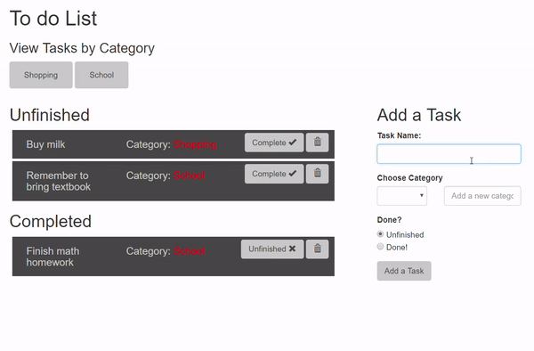

# MVC Todo List
This express todo list uses the MVC design pattern and a MySQL database
---
#### What it can do
* Add your plans and tasks by category to easily keep track of your progress

#### View the demo

---
#### To use this project
* Clone the repository
* Run `npm i` in the terminal
* Create a MySQL database called toDoList_db with the following table
```
CREATE TABLE `list` (
  `id` int(11) NOT NULL AUTO_INCREMENT,
   PRIMARY KEY (`id`),
  `item_name` varchar(150) NOT NULL,
  `category` varchar(150),
  `done` BOOLEAN
) ENGINE=InnoDB AUTO_INCREMENT=16 DEFAULT CHARSET=utf8;
```
```
* Run `node server.js`
---
#### Tools used in this project
* [npm my-sql](https://www.npmjs.com/package/mysql)
* [npm express](https://www.npmjs.com/package/express)
* [npm express-handlebars](https://www.npmjs.com/package/express-handlebars)
* [npm body-parser](https://www.npmjs.com/package/body-parser)